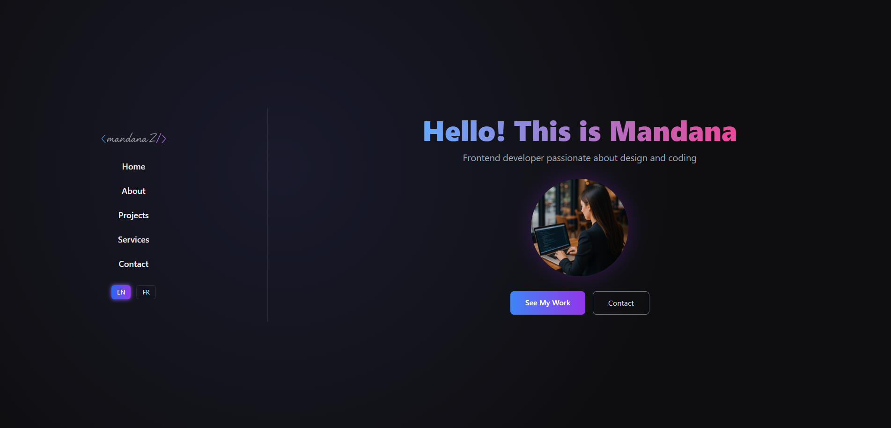

# 🌐 Portfolio Full-Stack — Mandana Zare  

Un **portfolio moderne de développeuse full-stack**, conçu avec **React**, **TypeScript**, **TailwindCSS**, **Framer Motion**, **Express** et **Prisma** — pour mettre en avant mes compétences techniques, ma créativité et ma passion pour le code propre.

---

## 🚀 Fonctionnalités

### 🖥️ Frontend (`portfolio-front`)
- ⚡ Développé avec **React + TypeScript**
- 🎨 Stylisé avec **TailwindCSS** (effets de dégradé et glassmorphisme)
- ✨ Animations fluides via **Framer Motion**
- 🌍 **Multilingue (EN / FR)** grâce à i18next
- 📱 Entièrement responsive avec détection mobile
- 🔗 Données des projets chargées dynamiquement via l’API GitHub

### 🧠 Backend (`portfolio-back`)
- ⚙️ Basé sur **Node.js + Express**
- 💾 Gestion de base de données via **Prisma ORM**
- 📡 API REST prête pour des données dynamiques (projets, contact)
- 🧩 Architecture modulaire avec gestion d’erreurs et validation

---

## 🧱 Stack Technique

| Couche | Technologies |
|--------|---------------|
| Frontend | React, TypeScript, TailwindCSS, Framer Motion |
| Backend | Node.js, Express, Prisma |
| Base de données | PostgreSQL |
| Déploiement | Vercel (Frontend), Render / Railway (Backend) |
| Contrôle de version | Git + GitHub |

---

## 📸 Aperçu

---

## 🧭 Structure du Projet

---

## 🧭 Aperçu des Sections Frontend

- **Hero :** Introduction dynamique avec texte dégradé et sélecteur de langue  
- **About :** Présentation personnelle + technologies maîtrisées  
- **Projects :** Projets animés chargés depuis GitHub  
- **Services :** Domaines de compétence illustrés par des icônes  
- **Contact :** Formulaire animé, multilingue et au design glass UI  

---

## ⚙️ Aperçu du Backend

| Endpoint | Description |
|-----------|-------------|
| `GET /api/projects` | Récupère la liste des projets depuis la base de données |
| `POST /api/contact` | Gère les messages envoyés via le formulaire |
| `GET /api/status` | Vérifie le bon fonctionnement du serveur |

---

## 👩‍💻 Auteure

**Mandana Zare**  
Développeuse Frontend | React, TypeScript, Node.js  
📧 mandana.ghz.1991@gmail.com  
🔗 [GitHub](https://github.com/mandanaghzare) · [LinkedIn](#)

---

## ⭐ Soutenir

Si ce projet vous plaît, laissez une **⭐ étoile** sur GitHub — votre soutien me motive à créer encore plus de projets innovants !  

---

## 🩵 Licence

Ce projet est distribué sous la licence **MIT** — libre à vous de l’utiliser et de le modifier avec attribution.
